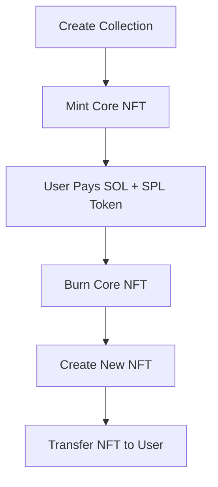

# 🧱 Core NFT Mint Protocol

> A Solana-based on-chain program to **create**, **mint**, **burn**, and **transfore** Core NFTs using SPL tokens and SOL.

## 🚀 Overview

This protocol lets users:

* Mint a **Core NFT** from a predefined collection.
* Pay with **SOL + SPL token** to **burn** the Core NFT and receive a **new NFT**.
* Transfer ownership of NFTs securely on-chain.

## 📦 Features

* ✅ Create NFT Collections using `mpl-core`
* ✅ Mint Core NFTs
* ✅ Burn Core NFTs conditionally (SOL & Token payments)
* ✅ Mint and transfer upgraded NFTs to users
* ✅ Event emission for off-chain tracking
* ✅ Secure account validation using Anchor

## 🛠 Stack

| Component   | Version |
| ----------- | ------- |
| anchor-lang | 0.30.1  |
| anchor-spl  | 0.30.1  |
| mpl-core    | 0.7.2   |
| Solana      | v1.18+  |

## 🧩 Program Flow

## 🔧 Setup

### Prerequisites

* [Solana CLI](https://docs.solana.com/cli/install-solana-cli)
* [Anchor CLI](https://book.anchor-lang.com/chapter_2/anchor_init.html)
* Node.js + Yarn (for frontend/integration testing)

## 🧪 Testing

The tests simulate:

* NFT collection creation
* Minting of Core NFTs
* Payment & burn logic
* Mint & transfer of final NFT

## 📬 Contact

* GitHub: [@SecretariatV](https://github.com/SecretariatV)
* Email: [oliver.b25.f@gmail.com](mailto:oliver.b25.f@gmail.com)
* Telegram: [@ares\_orb](https://t.me/ares_orb)
* Twitter (X): [@OVB\_Coder](https://x.com/OVB_Coder)